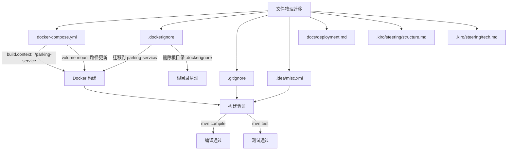

# 设计文档：后端服务目录重构

## 概述

本次重构的目标是将散落在仓库根目录的 Java 后端文件统一迁移到 `parking-service/` 子目录中，使其与 `admin-portal/`、`owner-app/` 同级，形成清晰的 monorepo 三模块结构。

这是一次纯结构重构，不涉及任何业务逻辑、Java 源码或 SQL 变更。核心工作包括：
1. 文件/目录物理迁移
2. 所有引用旧路径的配置文件和文档同步更新
3. 构建验证

### 迁移范围

| 文件/目录 | 迁移前位置（根目录） | 迁移后位置 |
|-----------|---------------------|-----------|
| `src/` | `./src/` | `./parking-service/src/` |
| `pom.xml` | `./pom.xml` | `./parking-service/pom.xml` |
| `Dockerfile` | `./Dockerfile` | `./parking-service/Dockerfile` |
| `.env.example` | `./.env.example` | `./parking-service/.env.example` |
| `.jqwik-database` | `./.jqwik-database` | `./parking-service/.jqwik-database` |
| `target/` | `./target/` | `./parking-service/target/` |

### 不迁移的文件

以下文件保留在根目录：
- `docker-compose.yml` — 编排所有服务，属于仓库级配置
- `.gitignore` — 仓库级忽略规则
- `.idea/` — IDE 项目级配置（仅更新内部路径引用）
- `docs/` — 项目文档目录
- `admin-portal/` — 前端管理后台
- `owner-app/` — 业主小程序
- `.kiro/` — Kiro 配置与 Spec

### 设计原则

- **最小变更原则**：仅修改因路径变化而必须更新的内容，不做任何功能性改动
- **Dockerfile 内部不变**：由于 `build.context` 从 `.` 变为 `./parking-service`，Dockerfile 内的 `COPY pom.xml .`、`COPY src ./src` 等相对路径仍然正确，无需修改
- **Java 包结构不变**：`com.parking` 包名和内部目录结构完全保持不变

## 架构

### 迁移前目录结构

```
/ (仓库根目录)
├── src/                    ← 后端源码（散落在根目录）
├── pom.xml                 ← Maven 配置
├── Dockerfile              ← 容器构建
├── .env.example            ← 环境变量模板
├── .jqwik-database         ← jqwik 测试数据库
├── target/                 ← 构建产物
├── docker-compose.yml
├── .dockerignore
├── .gitignore
├── .idea/
├── docs/
├── admin-portal/
├── owner-app/
└── .kiro/
```

### 迁移后目录结构

```
/ (仓库根目录)
├── parking-service/        ← 后端服务模块（新）
│   ├── src/
│   ├── pom.xml
│   ├── Dockerfile
│   ├── .env.example
│   ├── .jqwik-database
│   ├── .dockerignore       ← 新建，仅含后端相关忽略规则
│   └── target/
├── admin-portal/
├── owner-app/
├── docker-compose.yml      ← 更新路径引用
├── .gitignore              ← 更新路径规则
├── .idea/                  ← 更新 Maven 路径
├── docs/                   ← 更新文档中的路径引用
└── .kiro/                  ← 更新 steering 文档路径
```

### 变更影响流图



## 组件与接口

本次重构不涉及新增组件或接口。所有变更均为配置文件和文档的路径更新。

### 受影响的配置文件清单

| 文件 | 变更类型 | 变更内容 |
|------|---------|---------|
| `docker-compose.yml` | 路径更新 | `build.context` 和 MySQL volume mount 路径 |
| `parking-service/.dockerignore` | 新建 | 仅含后端构建上下文相关的忽略规则 |
| 根目录 `.dockerignore` | 删除 | 不再被 Docker 构建引用 |
| `.gitignore` | 路径更新 | `target/` → `parking-service/target/` 等 |
| `.idea/misc.xml` | 路径更新 | Maven 项目路径 |
| `docs/deployment.md` | 路径更新 | SQL 脚本路径、Maven 命令、jar 路径 |
| `.kiro/steering/structure.md` | 路径更新 | 源码目录前缀 |
| `.kiro/steering/tech.md` | 路径更新 | 配置文件路径、构建命令 |

### docker-compose.yml 变更详情

```yaml
# 变更前
services:
  mysql:
    volumes:
      - ./src/main/resources/sql/schema.sql:/docker-entrypoint-initdb.d/01-schema.sql
  parking-api:
    build:
      context: .
      dockerfile: Dockerfile

# 变更后
services:
  mysql:
    volumes:
      - ./parking-service/src/main/resources/sql/schema.sql:/docker-entrypoint-initdb.d/01-schema.sql
  parking-api:
    build:
      context: ./parking-service
      dockerfile: Dockerfile
```

### parking-service/.dockerignore 内容

```
.git
.gitignore
.jqwik-database
*.md
target
```

仅保留与后端构建上下文相关的忽略规则，移除 `admin-portal`、`owner-app`、`.kiro`、`.vscode`、`.idea` 等条目（这些目录不在 `parking-service/` 构建上下文中）。

### .gitignore 变更详情

```gitignore
# 变更前
target/
.jqwik-database

# 变更后
parking-service/target/
parking-service/.jqwik-database
parking-service/.env
```

其余规则（`.idea/`、`*.iml`、`.vscode/`、`.DS_Store`、`*.log`、`node_modules`、`admin-portal/dist/`）保持不变。

### .idea/misc.xml 变更详情

```xml
<!-- 变更前 -->
<option value="$PROJECT_DIR$/pom.xml" />

<!-- 变更后 -->
<option value="$PROJECT_DIR$/parking-service/pom.xml" />
```

## 数据模型

本次重构不涉及数据模型变更。数据库表结构、实体类、MyBatis 映射文件均保持不变。


## 正确性属性

*属性（Property）是指在系统所有合法执行路径中都应成立的特征或行为——本质上是对系统应做之事的形式化陈述。属性是人类可读规格说明与机器可验证正确性保证之间的桥梁。*

### Property 1: 文件迁移完整性

*对于所有*需要迁移的文件（`src/`、`pom.xml`、`Dockerfile`、`.env.example`、`.jqwik-database`、`target/`），迁移后它们应仅存在于 `parking-service/` 子目录下，且不再存在于仓库根目录。

**Validates: Requirements 1.1, 1.3**

### Property 2: 内部相对路径不变量

*对于* `parking-service/src/` 下的所有文件，其相对于 `parking-service/` 的路径应与迁移前相对于仓库根目录的路径完全一致（即 `parking-service/` 内部的目录树结构与迁移前的根目录后端文件树结构同构）。

**Validates: Requirements 1.2**

### Property 3: .dockerignore 构建上下文隔离

*对于* `parking-service/.dockerignore` 中的所有条目，都不应包含前端项目相关的路径（如 `admin-portal`、`owner-app`），且仅包含与后端构建上下文相关的忽略规则。

**Validates: Requirements 3.2**

### Property 4: 文档路径前缀一致性

*对于*所有项目文档（`docs/deployment.md`、`.kiro/steering/structure.md`、`.kiro/steering/tech.md`）中引用后端源码或构建产物的路径，都应以 `parking-service/` 为前缀，不应出现不带该前缀的裸路径（如裸 `src/main/`、`target/`、`pom.xml`）。

**Validates: Requirements 6.1, 7.1, 7.2**

## 错误处理

本次重构为纯文件迁移和配置更新，不涉及运行时错误处理逻辑的变更。

### 潜在风险与应对

| 风险 | 影响 | 应对措施 |
|------|------|---------|
| 文件迁移遗漏 | Maven 构建失败 | 通过 `mvn compile` 验证 |
| docker-compose.yml 路径错误 | Docker 构建失败 | 通过 `docker compose up --build` 验证 |
| .gitignore 规则未更新 | `target/` 等构建产物被误提交 | 迁移后执行 `git status` 确认 |
| .idea/misc.xml 路径错误 | IDE 无法识别 Maven 项目 | 在 IntelliJ 中重新加载项目验证 |
| 文档路径未更新 | 开发者按旧路径操作导致困惑 | 全文搜索旧路径确认无遗漏 |

## 测试策略

### 测试方法

由于本次重构是纯文件迁移和配置更新，测试策略以**构建验证**和**路径正确性检查**为主：

1. **构建验证（集成测试，需人工执行）**
   - 在 `parking-service/` 目录下执行 `mvn compile`，确认编译通过
   - 在 `parking-service/` 目录下执行 `mvn test`，确认所有测试通过
   - 执行 `docker compose up -d --build`，确认容器构建和启动正常

2. **路径正确性检查（可自动化）**
   - 验证所有需迁移的文件存在于 `parking-service/` 下
   - 验证根目录不再包含后端专属文件
   - 验证 `docker-compose.yml` 中的路径引用正确
   - 验证 `.gitignore` 中的路径规则已更新
   - 验证 `.idea/misc.xml` 中的 Maven 路径已更新
   - 验证文档中的路径引用已更新

### 属性测试

本项目使用 jqwik 1.8.4 作为属性测试库。但由于本次重构不涉及业务逻辑变更，属性测试主要用于验证文件系统状态的正确性。

每个属性测试应配置至少 100 次迭代，并通过注释引用设计文档中的属性编号：

```java
// Feature: parking-service-restructure, Property 1: 文件迁移完整性
// Feature: parking-service-restructure, Property 2: 内部相对路径不变量
// Feature: parking-service-restructure, Property 3: .dockerignore 构建上下文隔离
// Feature: parking-service-restructure, Property 4: 文档路径前缀一致性
```

### 单元测试

单元测试聚焦于具体的配置值验证：
- `docker-compose.yml` 中 `build.context` 的值为 `./parking-service`
- `docker-compose.yml` 中 MySQL volume mount 路径包含 `parking-service/`
- `.idea/misc.xml` 中 Maven 路径为 `$PROJECT_DIR$/parking-service/pom.xml`
- `.gitignore` 中包含 `parking-service/target/`、`parking-service/.jqwik-database`、`parking-service/.env`
- `docs/deployment.md` 中 Maven 命令包含 `cd parking-service`
- `docs/deployment.md` 中 jar 路径包含 `parking-service/target/`

### 验收测试清单

| 验收项 | 验证方式 | 对应需求 |
|--------|---------|---------|
| 后端文件存在于 `parking-service/` | 文件系统检查 | 1.1 |
| 根目录无后端专属文件 | 文件系统检查 | 1.3 |
| `docker compose up --build` 成功 | 人工执行 | 2.3 |
| `parking-service/.dockerignore` 存在且内容正确 | 文件内容检查 | 3.1, 3.2 |
| 根目录 `.dockerignore` 已删除 | 文件系统检查 | 3.3 |
| `.gitignore` 路径已更新 | 文件内容检查 | 4.1, 4.2, 4.3 |
| `.idea/misc.xml` Maven 路径已更新 | 文件内容检查 | 5.1 |
| `docs/deployment.md` 路径已更新 | 文件内容检查 | 6.1, 6.2, 6.3 |
| steering 文档路径已更新 | 文件内容检查 | 7.1, 7.2 |
| `mvn compile` 通过 | 人工执行 | 8.1 |
| `mvn test` 通过 | 人工执行 | 8.2 |
